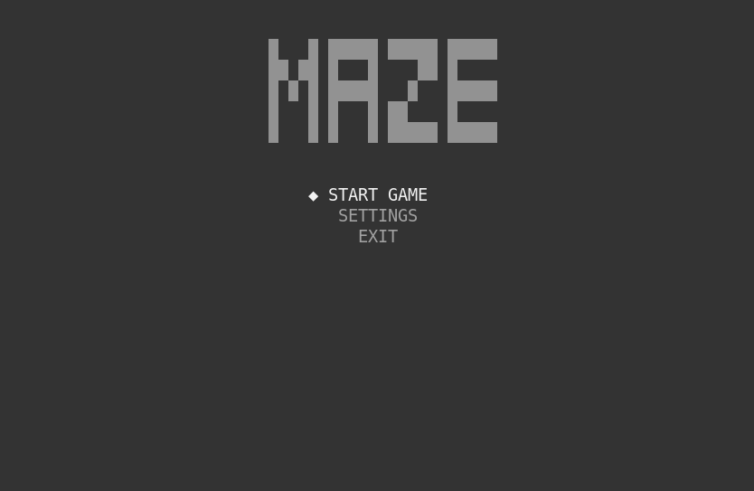
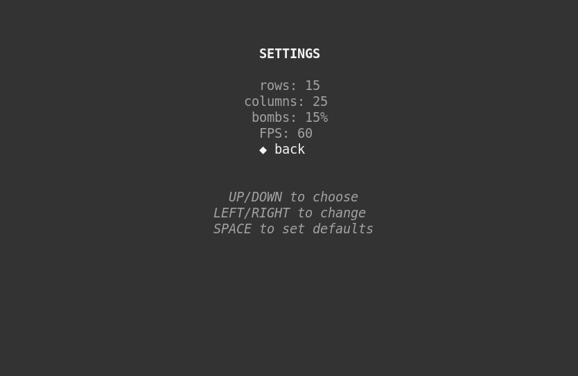
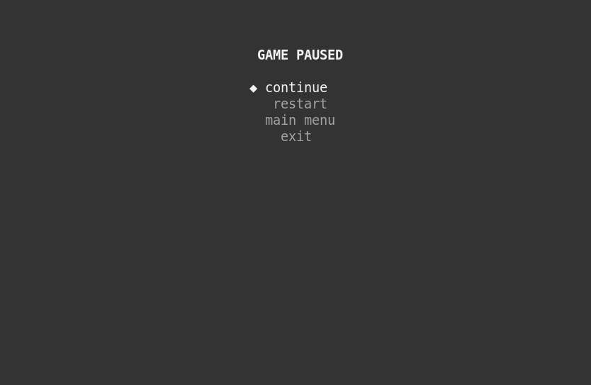
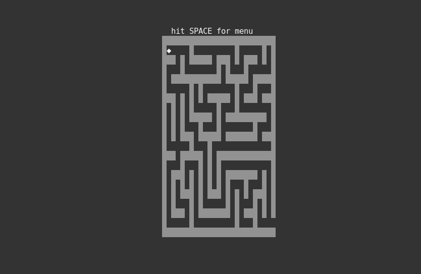
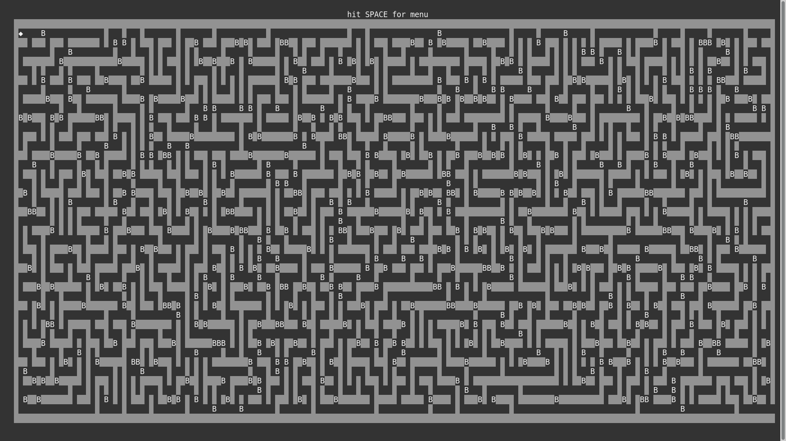
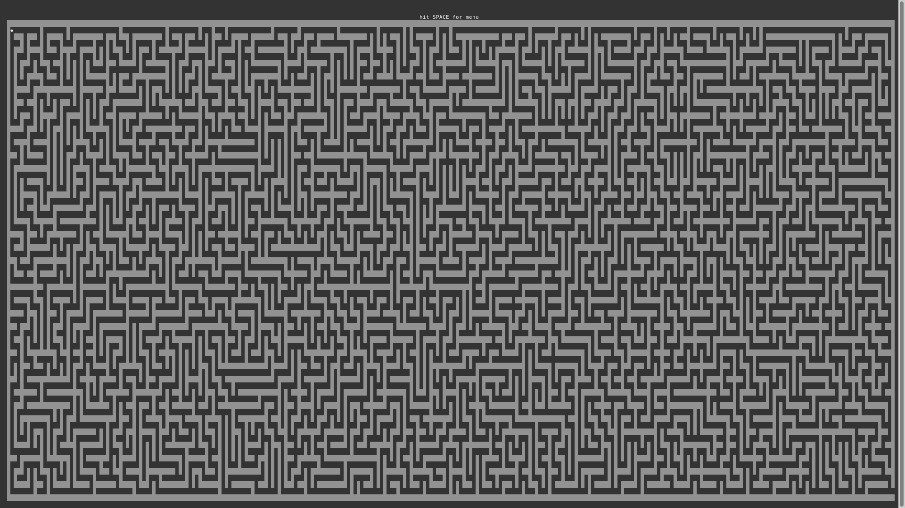
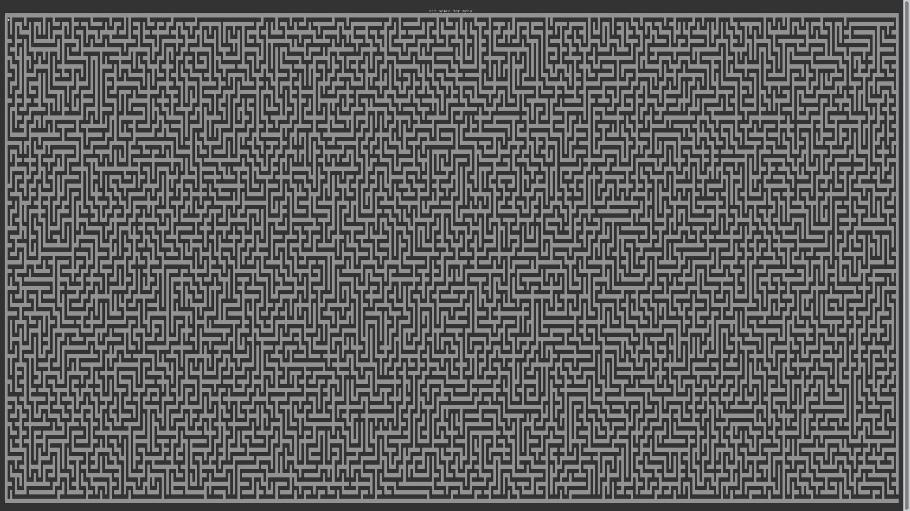
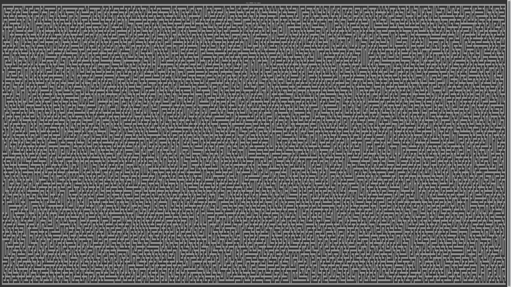

# Randomly Generated Maze Game in C++ and ncurses

This is just another Maze game, written in C++ and ncurses on Linux. It has a Main Menu, Pause Menu and Settings Menu. Game field, bombs percentage and FPS can be manipulated in Settings Menu. The Maze field is randomly generated everytime you hit New Game in Main Menu, using my own implementation of Depth First Search.

